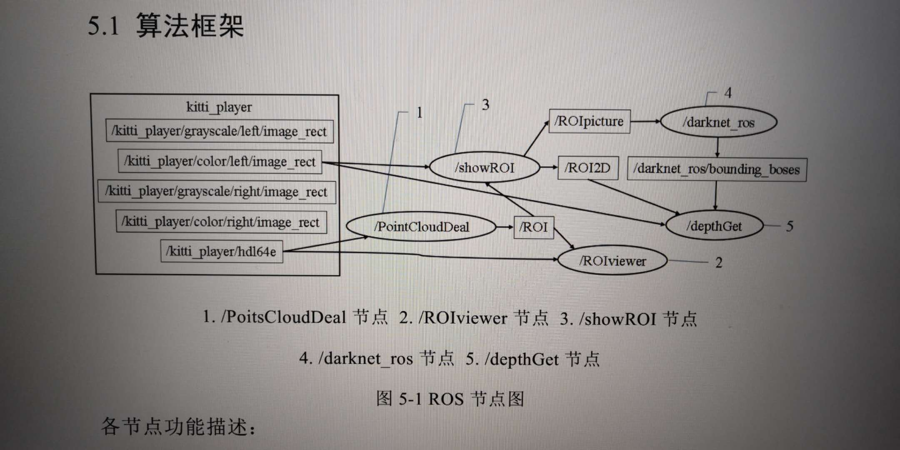
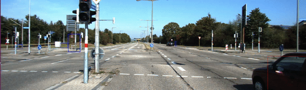

# camera-lidar-fusion-ros 

There are 4 ros package:

- darknet_ros : Yolov3 
- depthGet : fusion
- opencv_deal : 3D box to 2D, deal with 2D box occupation

- pcl_deal : deal with lidar pointcloud and visulization

The ros node graph is below.

## How to run

### prepare

you need kitti_player node and download the Yolo weight.

### have fun

change the ros topic name. Then do as ros package

# result

The light blue box is result of lidar. The light red  box is result of Yolo. The dark red box is result of fusion.

