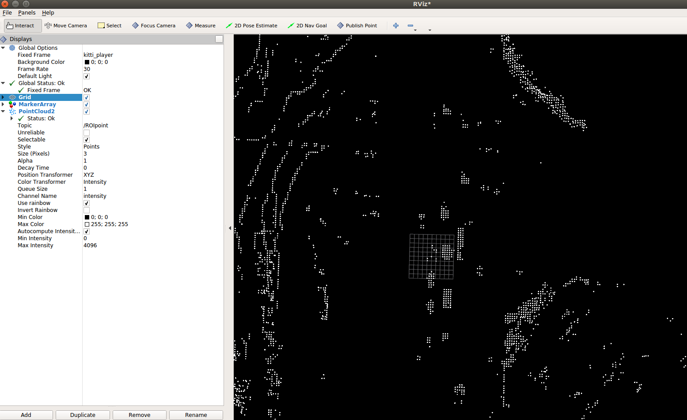

# Camera-Lidar-Fusion-ROS 

## Introduction

There are 5 ros package:

- kitti_player : publish KITTI data.
- pcl_deal : contain `/PointCloudDeal` and `/ROIviewer`.  Objects are detected by simple height threshold.
- opencv_deal : 3D box to 2D. 3D-2Dbox overlap is simply solved by IoU and several rules. (The origin idea is to detection on `/ROIpicture`, but the result is not very good. `/ROI2D` is results of the 3D-2Dbox.)
- darknet_ros_old : Yolov3 detection node. It is a old version of [eggedrobotics/darknet_ros](https://github.com/leggedrobotics/darknet_ros). Thanks to their job.
- depthGet : fuse 3D-2Dbox and 2D-YOLObox in picture Coordinate by simple IoU.

The ROS node graph is as below.


## Result

The light blue box is result of Lidar. The light red  box is result of YOLO. The dark red box is result of fusion.


## How to run

### Requirement 

ROS；OpenCV；PCL

### Prepare

- Download KITTI dataset into `kitti_player/`.  You can get from [Baidu Wangpan]( https://pan.baidu.com/s/1LEUfrkkqPEM3rdOwEa7liQ) password: w4qk.
- Download the Yolo weight into `darknet_ros_old/darknet_ros/yolo_network_config/weights/`. Please do as [eggedrobotics/darknet_ros](https://github.com/leggedrobotics/darknet_ros). Or you can also get YOLOv3 weights from [Baidu Wangpan]( https://pan.baidu.com/s/1LEUfrkkqPEM3rdOwEa7liQ) password: w4qk.

### Build

Check the data path and ros topic name (if you use your own dataset).

Finally, `catkin_make`. 

### Run

- Punlish kitti data

  ```
  roslaunch kitti_player kittiplayer_standalone.launch
  ```

  


- Point cloud detection

  ```
  rosrun pcl_deal pointdeal 
  ```

  Three monitoring  method are provided.

  - You can use `rosrun pcl_de pclvis` to see point cloud in PCL.

    

  

  - You can use `rviz` to subscribe `/ROIpoint` topic in order to see the 2D grid results.

    

  - You can use  `rosrun pcl_de ROIviewer` to monitor the point cloud detection result.

    

- 3D boxes to 2D

  ```
  rosrun opencv_deal showROI
  ```

- YOLOv3

  ```
  roslaunch daret_ros_lod yolo_v3.launch
  ```

  

- Finally, fuse category and location

  ```
  rosrun depthG depthget
  ```

  Then, have fun ! You can see the result through `/depthMap` topic.

## Note

It's a part of my undergraduate thesis. There are likely many spelling mistake and redundant code. And the codes are ugly. But I will be happy if this repo can help you. Please feel free to open an issue if you have any questions.